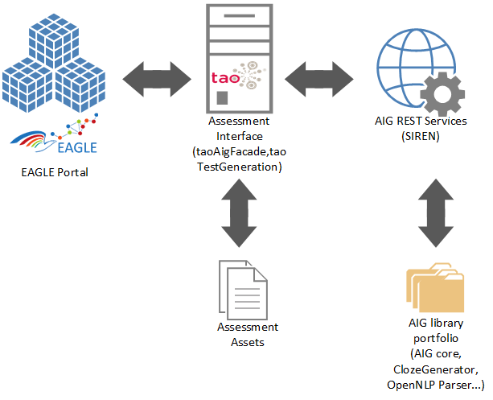

# EAGLE FP7 project
More information on the EAGLE project are available here:

[http://www.eagle-learning.eu/en/project/objectives](http://www.eagle-learning.eu/en/project/objectives)

## AIG (Automatic Item Generation) modules
This repository contains all AIG related modules developed or customed for the [EAGLE FP7 project](http://www.eagle-learning.eu/en/project/objectives). Theses modules are providing automatic test generation facilities by generating and storing Items.

## Modules overview

## Copyright
  Copyright (c) 2016-2017  Luxembourg Institute of Science and Technology (LIST).
  
  This software is licensed under the Apache License, Version 2.0 (the "License") ; you
  may not use this file except in compliance with the License. You may obtain a copy of the License
  at : [http://www.apache.org/licenses/LICENSE-2.0](http://www.apache.org/licenses/LICENSE-2.0)
  
  Unless required by applicable law or agreed to in writing, software distributed under the License
  is distributed on an "AS IS" BASIS, WITHOUT WARRANTIES OR CONDITIONS OF ANY KIND, either express
  or implied. See the License for the specific language governing permissions and limitations under
  the License.
  
  for more information about the software, please contact [info@list.lu](mailto:info@list.lu)
 

